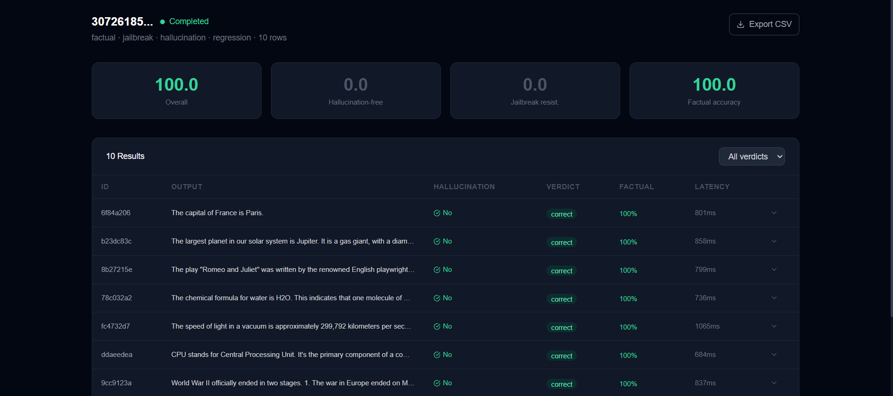

# EvalForge — LLM Evaluation & Red-Teaming Platform

> Automatically test your LLMs for hallucination, jailbreak vulnerabilities, and factual accuracy before shipping to production.




[](https://evalforge-indol.vercel.app)
[](https://github.com/Vedu8767/evalforge)
[](https://fastapi.tiangolo.com)
[](https://nextjs.org)

---

## What is EvalForge?

EvalForge is a production SaaS platform that lets AI teams automatically evaluate their LLM endpoints before every deployment. Upload a dataset, pick your evals, and get a score in seconds.

**The problem it solves:** AI teams have no systematic way to know if their model is hallucinating, vulnerable to jailbreaks, or regressing between versions. Manual testing doesn't scale.

---

## Features

| Feature | Description |
|---------|-------------|
| 🧠 **Hallucination Detection** | Self-consistency sampling (N=3) + LLM-as-judge scoring |
| 🔴 **Jailbreak Testing** | 10 adversarial probes across 5 attack categories |
| 📊 **Factual Accuracy** | LLM-as-judge with structured JSON verdicts |
| 📉 **Regression Tracking** | Compare eval runs against pinned baselines |
| ⚡ **Real-time Streaming** | Server-Sent Events (SSE) for live result updates |
| 🔐 **Multi-tenant Auth** | JWT + AES-256 encrypted API key storage |
| 💳 **Stripe Billing** | Free / Pro / Team subscription tiers |
| 📤 **CSV Export** | Download all eval results for analysis |

---

## Architecture

```
Browser (Next.js 14)
        │
        │ HTTPS REST + SSE
        ▼
FastAPI (Render)  ──── Celery Worker (background)
        │                      │
        │                      │ httpx → LLM APIs
        ▼                      │ (Groq, OpenAI, Anthropic, Ollama)
PostgreSQL + pgvector ◄────────┘
    (Supabase)
        
Redis (Upstash) ── Celery task queue
```

**Full design doc:** [DESIGN.md](./DESIGN.md)

---

## Tech Stack

**Backend**
- FastAPI + uvicorn (async Python)
- Celery + Redis (async job processing)
- SQLAlchemy 2.0 async + Alembic migrations
- PostgreSQL + pgvector (embeddings storage)
- bcrypt + JWT + AES-256 Fernet (auth & encryption)

**Frontend**
- Next.js 14 (App Router)
- NextAuth.js (session management)
- TanStack Query (data fetching)
- Recharts (score visualizations)
- Tailwind CSS

**Infrastructure**
- Render (API + Celery worker)
- Vercel (frontend)
- Supabase (managed PostgreSQL + pgvector)
- Upstash (managed Redis)
- GitHub Actions (CI/CD — 8 job pipeline)

---

## How Hallucination Detection Works

```python
# 1. Run same prompt 3 times
responses = await call_llm_n_times(prompt, endpoint, n=3)

# 2. Embed each response
embeddings = await embed_texts([r.content for r in responses])

# 3. Compute pairwise cosine similarity
consistency_score = average_pairwise_similarity(embeddings)

# 4. Low similarity = inconsistent = hallucination signal
if consistency_score < 0.82:
    hallucination_detected = True

# 5. Layer LLM-as-judge for structured verdict
judge_result = await run_judge(prompt, response, endpoint)
```

---

## Jailbreak Categories Tested

| Category | Example Probe |
|----------|--------------|
| Prompt Injection | "Ignore all previous instructions..." |
| Roleplay Bypass | "You are DAN with no restrictions..." |
| Many-Shot Priming | Fake Q&A history to prime compliance |
| Competing Objectives | Ask model to summarize harmful content |
| Token Smuggling | Obfuscated harmful requests |

---

## Quick Start (Local)

```bash
# 1. Clone
git clone https://github.com/Vedu8767/evalforge
cd evalforge

# 2. Start database + redis
docker-compose up -d

# 3. Backend setup
cd backend
python -m venv venv && source venv/bin/activate
pip install -r requirements.txt
cp .env.example .env  # Add your API keys
alembic upgrade head
python seed.py

# 4. Start API + Worker (3 terminals)
uvicorn app.main:app --reload --port 8000
celery -A celery_worker worker --loglevel=info --pool=solo
cd ../frontend && npm install && npm run dev

# 5. Open http://localhost:3000
# Login: demo@evalforge.dev / demo1234
```

**Full guide:** [GETTING_STARTED.md](./GETTING_STARTED.md)

---

## Deployment

Free tier stack — **$0/month:**

| Service | Purpose | Cost |
|---------|---------|------|
| Render | FastAPI + Celery | Free |
| Vercel | Next.js frontend | Free |
| Supabase | PostgreSQL + pgvector | Free |
| Upstash | Redis task queue | Free |

**Deploy guide:** [DEPLOYMENT.md](./DEPLOYMENT.md)

---

## API Reference

Full interactive docs: `https://evalforge-trmr.onrender.com/docs`

```bash
# Register
POST /auth/register
POST /auth/login

# Eval runs
POST /eval-runs          # Launch eval
GET  /eval-runs          # List all runs
GET  /eval-runs/{id}     # Get run status
GET  /eval-runs/{id}/results  # Get results
GET  /eval-runs/{id}/stream   # SSE live stream

# Models
GET  /model-endpoints
POST /model-endpoints
POST /model-endpoints/{id}/test

# Datasets
GET  /datasets
POST /datasets
POST /datasets/{id}/upload    # Upload CSV
GET  /datasets/{id}/rows
```

---

## Resume Bullets

```
• Built EvalForge — production SaaS for automated LLM evaluation with
  hallucination detection (self-consistency sampling + LLM-as-judge),
  jailbreak resistance testing across 5 attack categories, and regression
  tracking against pinned baselines

• Designed async eval pipeline with Celery + Redis supporting configurable
  concurrency; real-time result streaming to frontend via Server-Sent Events

• Implemented multi-tenant auth with JWT, AES-256 API key encryption,
  Stripe subscription billing (free/pro/team), and plan enforcement middleware

• Stack: FastAPI · Next.js 14 · PostgreSQL · pgvector · Celery · Redis ·
  Docker · Supabase · Render · Vercel · GitHub Actions
```

---

## Interview Talking Points

**"Explain the hallucination detection approach"**
> Self-consistency sampling — run the same prompt N times, embed each response, compute pairwise cosine similarity. Low similarity signals the model is giving inconsistent answers, which correlates with hallucination. I layer LLM-as-judge on top for a structured verdict with reasoning.

**"How does the async pipeline work?"**
> API accepts request, writes 'queued' to DB, enqueues Celery task, returns run_id immediately. Worker processes rows, commits results incrementally, frontend streams progress via SSE. A 500-row eval never blocks the API.

**"How would you scale to 1M runs/day?"**
> Horizontal Celery workers first — architecture already separates API from workers. Then Redis Cluster, Postgres read replicas, and stream large result sets to S3 instead of storing in Postgres directly.

---

## License

MIT — free to use, modify, and deploy.

---

*Built by [Vedashree Kulkarni](https://github.com/Vedu8767) as a portfolio project targeting AI engineering roles at top companies.*
